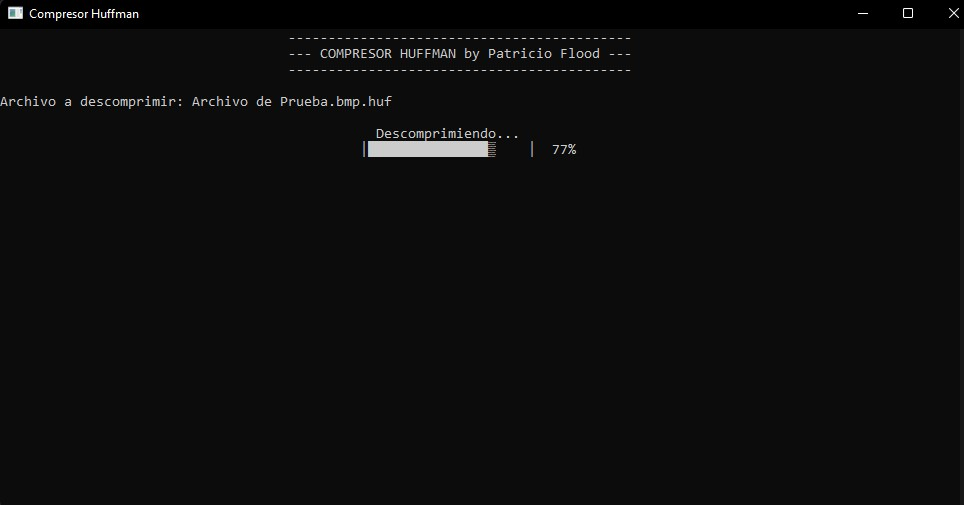

# Huffman Compressor/Decompressor

Made with C++ in 2020 for the UTN Algorithms and Data Structures class

### Ways to use the program:

1. Drag and drop:
  
    Drag the file you want to compress or decompress into the "HuffmanCompressor.exe" executable.

2. Manual:
   
   Open the executable "HuffmanCompressor.exe" and write the name or path and name of the file (if it is in another folder).

* If your file was not compressed, a compressed file will have been created instead with a '.huf' extension (the original file will not be deleted), otherwise, if the file was compressed, the uncompressed file will be returned to you.

* If you only want to test the functionality of the program use the test file "TestFile.bmp", after compressing it, delete it and try uncompressing it.

### Screenshots:

